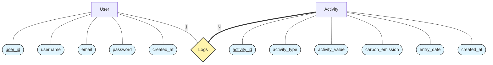

# Personal Carbon Footprint Tracker

A full-stack web application that allows users to calculate, monitor, analyze, and reduce their individual carbon emissions by logging daily activities.

## Features
- **User Authentication**: Secure Login and Registration.
- **Dashboard**: Real-time summary of total emissions and recent activities.
- **Activity Logging**: Log activities like Transportation, Electricity, Food, and Waste.
- **Carbon Calculation**: Automatic calculation of CO2e based on activity type and value.
- **History**: View and manage complete history of logs.
- **Analytics**: Visual charts showing emission trends over time and by category.

## Technology Stack
- **Frontend**: HTML5, CSS3, Bootstrap 5, JavaScript, Chart.js
- **Backend**: Native PHP (8.0+)
- **Database**: MySQL

## Setup Instructions

### 1. Database Setup
Ensure you have MySQL installed and running.

1. Create the database and tables using the provided schema:
   ```bash
   mysql -u root -p < database/schema.sql
   ```
2. Configure the connection in `config/db.php` if your credentials differ from the default (`root` / empty password).

### 2. Run the Application
You can use the built-in PHP development server to run the application efficiently.

1. Navigate to the project root directory.
2. Start the server targeting the `public` folder:
   ```bash
   php -S localhost:8000 -t public
   ```
3. Open your browser and visit:
   [http://localhost:8000](http://localhost:8000)

## Usage
1. **Register**: Create a new account.
2. **Log Activity**: Go to the "Log Activity" page, select a type (e.g., "Transport - Car"), and enter the value (e.g., distance in km).
3. **View Analytics**: Check the Dashboard and Analytics pages to see your impact visualized.

## Folder Structure
- `config/`: Database configuration.
- `database/`: SQL schema files.
- `public/`: Publicly accessible files (PHP pages, CSS, JS).
  - `api/`: Backend logic endpoints.
  - `includes/`: Reusable UI components (header, footer).
- `src/`: Core PHP classes (`Auth`, `ActivityManager`, `CarbonCalculator`).

ER diagram



Relational Schema
erDiagram
    USERS ||--o{ ACTIVITIES : "logs"
    USERS {
        int user_id PK
        string username
        string email
        string password
        datetime created_at
    }
    ACTIVITIES {
        int activity_id PK
        int user_id FK
        string activity_type
        float activity_value
        float carbon_emission
        date entry_date
        datetime created_at
    }

## License
MIT
